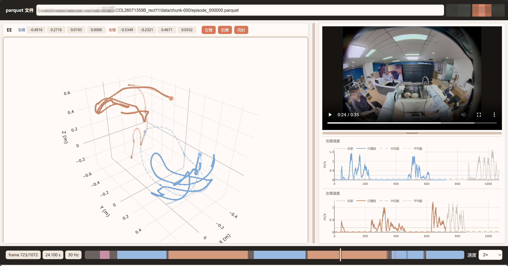
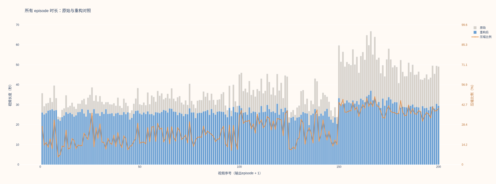
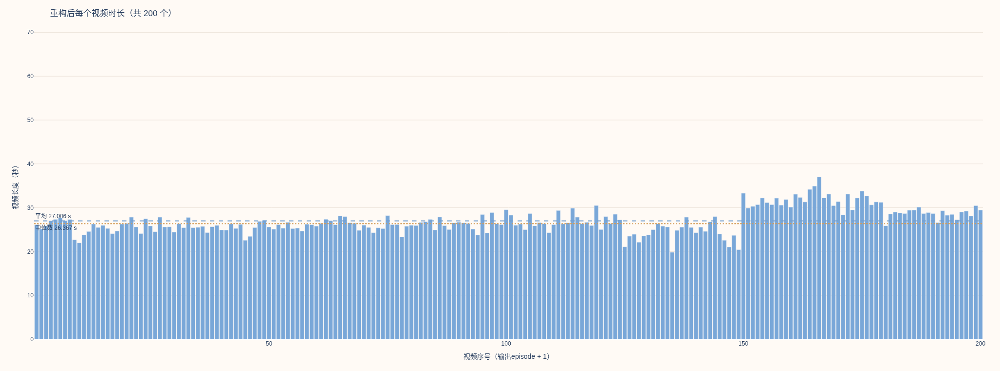

<div align="center">
  
  <h1>LeRobot Trajectory Studio</h1>
  <p><strong>LeRobot 轨迹工作台</strong> · 轨迹、视频与速度同步查看。</p>
  <p>
    <a href="https://peaceful-world-x.github.io/LeRobot_TraceLab/"><strong>在线查看器</strong></a> ·
    <a href="https://github.com/Peaceful-World-X/LeRobot_TraceLab"><strong>项目仓库</strong></a> ·
    <a href="public/README.md"><strong>使用说明</strong></a>
  </p>
  <p>
    <a href="https://github.com/Peaceful-World-X/LeRobot_TraceLab/stargazers"></a>
    <a href="https://github.com/Peaceful-World-X/LeRobot_TraceLab/issues"></a>
  </p>
</div>

支持 LeRobot v2.1 中等长位姿向量与独立 MP4 的同步查看，内置 H01、RoboDojo、EBench、Robocasa365、RoboTwin2 类别及自定义字段映射。

## 已支持的评测数据集演示

公开页面内置以下评测数据集的 episode 0 示例：

| 类别 | 位置字段 | 视频键 | 示例信息 |
| --- | --- | --- | --- |
| H01_v1（默认） | `observation.state_endpose_quat` | `observation.images.cam_fisheye_front` | 新版 Link_Base TCP，783 帧，30 Hz |
| H01 | `observation.state_endpose_quat` | `observation.images.cam_fisheye_front` | 783 帧，30 Hz |
| RoboDojo | `observation.state` | `observation.images.cam_high` | 579 帧，25 Hz |
| Ebench | `state.ee_pose` | `video.overlook_camera_view` | 3324 帧，15 Hz |
| Robocasa365 | `observation.state` | `observation.images.robot0_agentview_right` | 1272 帧，20 Hz，单臂 |
| RoboTwin2 | `observation.state` | `observation.images.cam_high` | 462 帧，50 Hz |

这些示例用于演示轨迹、视频、速度曲线和单臂/双臂同步查看；完整数据集不随网页发布。

- **浏览器导入：** 选择数据集目录并指定 Episode，自动匹配视频和 FPS；也可通过弹窗分别选择 parquet 和 MP4。
- **同步查看：** 完整轨迹、逐帧点、播放进度高亮、速度曲线、倍速与点选跳转。
- **服务器模式：** 使用 Python 服务读取服务器数据；公开版在浏览器本地处理选中的文件。

## 页面预览

<p align="center"></p>
<p align="center"><sub>左侧查看空间轨迹，右侧对照视频和速度，按同一帧同步播放。</sub></p>

<details>
<summary>数据重构时长对比</summary>

<p align="center"></p>
<p align="center"></p>

</details>

## 轨迹查看

公开网页首次打开会自动加载仓库内置的 `example` episode 0，无需先选择本地目录；也可以点击“数据集目录”选择自己的 LeRobot 数据集。

```bash
pip install fastapi 'pydantic>=2' uvicorn pyarrow numpy scipy plotly pyyaml

cd $WORKDIR/H01_TraceLab
python ee_video_viewer.py
```
- 打开 http://localhost:9090，选择类别，输入服务器上的数据集总目录，再填写 episode 数字并加载。
- 不同数据集类别信息, 左右臂本体定义，显示坐标方向，记录在 ee_video_viewer.yaml
- 速度平均数和中位数只统计速度大于 0 的有效帧。

## 数据集重构

```bash

# 工作脚本
python reconstruct_dataset.py \
  --source-root $WORKDIR/COL26071359B_rect11 \
  --all-episodes \
  --target-duration 24 \
  --workers 16

# 其他同任务数据集，单个 episode（输出会重新编号为 episode 0）
python reconstruct_dataset.py --source-root /path/to/dataset --episode 3

# 完整数据集只做分析；不编码视频、不创建或替换输出
python reconstruct_dataset.py --source-root /path/to/dataset --all-episodes --plan-only > analysis.json

# 只生成前置鱼眼视角；不加 --video 时仍生成全部视角
python reconstruct_dataset.py --video observation.images.cam_fisheye_front
python reconstruct_dataset.py --video observation.images.cam_fisheye_front observation.images.cam_high
python reconstruct_dataset.py --video observation.images.cam_fisheye_front --video observation.images.cam_high
```

说明:
1. 当前数据集左右手几乎是先后移动的
2. 整个数据集可以分为五个阶段：右手倒垃圾得到空碗、左手顶开洗碗柜盖、右手放空碗然后顶着洗碗柜盖、左手放空碗然后复位、右手复位

规则：
1. 确定有效起点：从第 0 帧向后扫描，要求右臂速度连续超过启动阈值、左臂基本静止、右臂方向稳定且没有明显回摆；起点之前的帧全部删除。
2. 删除双臂静止帧：逐帧判断左右末端速度、手臂关节速度、夹爪变化、头部/腰部变化和底盘变化；全部低于阈值且不属于保护区的帧标记为静止并删除。
3. 保护夹爪事件：检测夹爪连续变化区间；夹爪打开、闭合及其连续收尾帧全部保留，静止删除和普通抽帧都不能跨过这些帧。
4. 识别五个动作阶段：根据左右臂的平滑速度和主臂速度优势，识别右—左—右—左—右的阶段边界；阶段边界附近的关键帧会被保留。
5. 保护主要空间转折：计算局部运动方向变化；方向变化超过主要转向阈值的点作为轨迹锚点，不允许普通抽帧删除。
6. 平滑低曲率速度低谷：对速度做中值滤波，找到速度明显下降但前后方向基本一致的区间；在该区间尝试删除中间帧，使相邻帧速度更接近前后参考速度。
7. 压缩重复回摆：如果轨迹先移动后返回邻近位置、没有夹爪事件且没有跨越主要转折，则认为是冗余回摆，允许用首尾帧连接并删除中间帧。
8. 阶段二上下运动保护：对左臂阶段二的 Z 轴极值进行检测，保留主要下降最低点和后续上升转折点，只压缩小幅重复动作。
9. 复位段密集保帧：左臂阶段四夹爪动作之后的复位段使用更密集的采样，避免复位过程被过度抽稀。
10. 右臂末段单向退离：阶段五根据离开方向计算累计进度，候选帧路径不允许超过约 1 mm 的反向回退；只有满足事件、动态和位姿约束的抽帧方案才接受。

约束：
- 新相邻帧的末端位移、关节变化和姿态角不能超过设定上限。
- 跳过的原始轨迹点必须接近首尾连线，防止改变路径形状。
- 抽帧后不能遗漏夹爪事件、主要转折和阶段锚点。
- 如果候选方案不满足约束，则回退并保留原始帧。

结果：
- 200 条 episode，225172 → 162034 帧；
- 平滑段最终速度中位数范围 0.351–0.648 m/s。
- 重构后数据集平均时长 37.5s -> 27.0s，平均帧数 1126 → 813，平均速度中位数 0.48 → 0.50 m/s，最后 50 条 50.252 → 30.500 秒；
